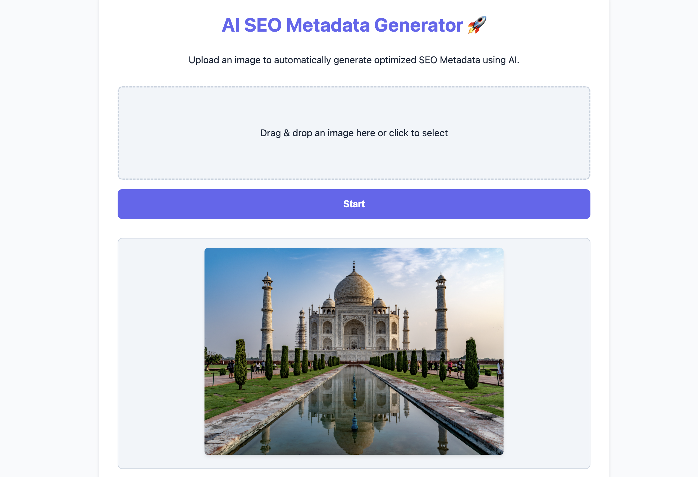
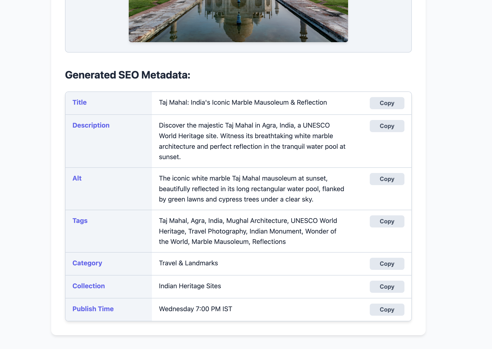

# 🚀 AI SEO Metadata Generator

## 📸 Preview

### 📤 Image Upload Interface


### 🧠 Generated SEO Metadata


## 🌐 Live Demo

https://ai-seo-metadata-generator.vercel.app/

---

## 🧠 Overview

AI-powered web application that generates SEO metadata from uploaded images using Google Gemini AI.

Users can upload an image and instantly receive optimized SEO content including:

- SEO Title
- Meta Description
- Alt Text
- Keywords / Tags
- Category
- Collection Name
- Best Publish Time

---

## 🔥 Features

- 📷 Image upload with preview
- 🤖 AI-powered SEO generation using Google Gemini
- 🏷️ SEO Title generation
- 📝 Meta Description generation
- 🖼️ Alt Text generation
- 🔖 Tags / Keywords generation
- 📂 Category detection
- 📚 Collection suggestions
- ⏰ Best Publish Time recommendation
- 📋 One-click copy functionality
- ⚠️ Error handling and validation
- 📦 5 MB maximum image upload limit
- ⚡ Fast processing with Node.js & Express

---

## 🏗️ Project Structure

```bash
├── controllers/
│   └── seoController.js
├── routes/
│   └── seoRoutes.js
├── services/
│   └── geminiService.js
├── public/
│   ├── index.html
│   ├── script.js
│   └── style.css
├── uploads/
├── server.js
├── .env
├── package.json
└── README.md
```

---

## 🛠 Tech Stack

### Frontend

- HTML5
- CSS3
- Vanilla JavaScript

### Backend

- Node.js
- Express.js
- Multer

### AI

- Google Gemini API
- Gemini 2.5 Flash

### Deployment

- Vercel

---

## ⚙️ Setup Instructions

### 1️⃣ Clone Repository

```bash
git clone https://github.com/ajith-fullstack/ai-seo-metadata-generator.git
cd ai-seo-metadata-generator
```

### 2️⃣ Install Dependencies

```bash
npm install
```

### 3️⃣ Configure Environment Variables

Create a `.env` file:

```env
GEMINI_API_KEY=your_api_key_here
PORT=3000
```

### 4️⃣ Start Development Server

```bash
node server.js
```

### 5️⃣ Open Browser

```text
http://localhost:3000
```

---

## 🔌 API Endpoint

### POST `/api/seo/generate`

#### Form Data

| Key | Type |
|------|------|
| image | File |

Supported formats:

- JPG
- JPEG
- PNG
- WEBP

Maximum upload size:

```text
5 MB
```

---

## 🧪 Example Output

```json
{
  "title": "Modern Wooden Chair for Living Room",
  "description": "Enhance your space with this stylish wooden chair...",
  "alt": "wooden chair in modern living room",
  "tags": ["chair", "furniture", "modern"],
  "category": "Furniture",
  "collection": "Living Room Collection",
  "publish_time": "Friday 6 PM IST"
}
```

---

## 🔐 Best Practices Implemented

- Environment variables for API security
- MVC-inspired project structure
- Separate Service Layer for Gemini API integration
- Modular architecture (Controllers, Routes, Services)
- Error handling for API failures
- Invalid JSON response handling
- Client-side file validation
- 5 MB upload restriction
- Loading states for better UX
- Copy-to-clipboard functionality
- Clean JSON response formatting

---

## 🎯 Use Case

This project demonstrates how AI can be used to generate SEO metadata directly from images. It helps developers, marketers, store owners, and content creators quickly generate SEO-friendly content without manually writing metadata.

Ideal for:

- E-commerce products
- Blog images
- Marketing assets
- Digital catalogs
- Content management systems

---

## 👨‍💻 Author

**AjithKumar**  
Full Stack Developer

- GitHub: https://github.com/ajith-fullstack
- LinkedIn: https://www.linkedin.com/in/ajith-kumar-87817b248

---